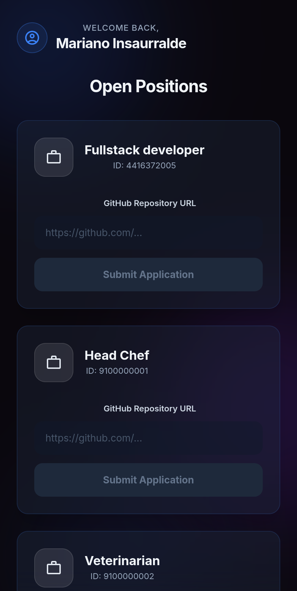
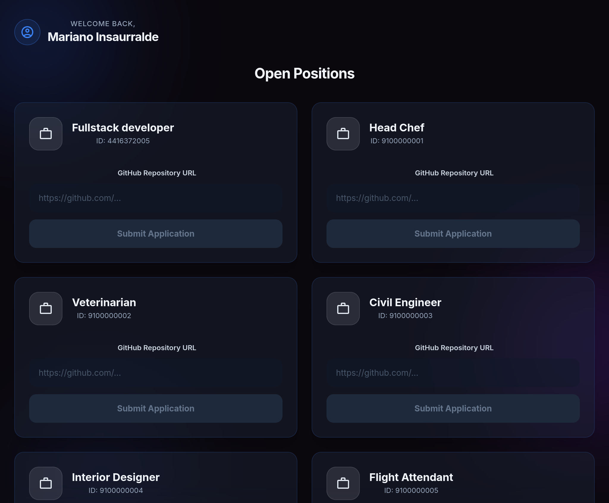
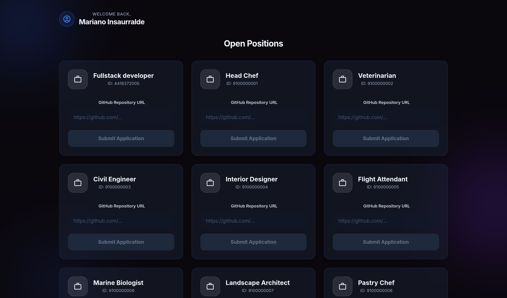

# Nimble Gravity Challenge - Job Application Dashboard


A modern, responsive React application for visualizing and applying to job openings. 
The interface was designed with a focus on a premium User Experience (UX) and an appealing User Interface (UI), featuring *Dark Mode*, *glassmorphism*, and seamless adaptability to any screen size.

## 🚀 Technologies Used

- **React.js**: Core library for building user interfaces.
- **Tailwind CSS v3**: Utility-first CSS framework for rapid, modern, and responsive styling.
- **JavaScript (ES6+)**: Main programming language.

## ✨ Features

- **Dynamic Job Listings**: Fetching open positions directly from the API (Endpoint `GET /api/jobs/get-list`).
- **Seamless Integrated Application**: An embedded form within each job card to input a GitHub repository URL and submit the application (Endpoint `POST /api/candidate/apply-to-job`).
  - *Bug Fix - 400 Bad Request:* During integration, the API returned a hidden 400 error indicating that `applicationId` was missing in the payload. This was successfully resolved by parsing `applicationId` from the candidate profile and injecting it alongside the required UUID, jobId, and candidateId.
- **Authentication (Mocked)**: Fetching candidate information based on their email address (Endpoint `GET /api/candidate/get-by-email`).
- **UI State Management**: 
  - *Loading State*: Interface skeletons (*Shimmer Effects*) that enhance the perception of speed.
  - *Error States*: Clear visual feedback for both initial load failures and rejected application requests from the server (with explicit support for HTTP 400 validation origins).
- **Responsive Design (Mobile First)**: 
  - *Smartphones*: Single-column vertical card layout.
  - *Tablets and Monitors (Desktop)*: Adaptability utilizing a multi-column grid layout (`grid-cols-2` and `grid-cols-3` depending on available space).

## 🛠 Installation and Local Setup

1. **Clone the repository and enter the directory:**
   ```bash
   git clone https://github.com/marianoInsa/nimble-gravity-challenge.git
   cd nimble-gravity-challenge
   ```

2. **Configure environment variables:**
   Create a `.env` file in the root of the project with the following configuration:
   ```env
   REACT_APP_API_URL=https://botfilter-h5ddh6dye8exb7ha.centralus-01.azurewebsites.net
   ```

3. **Install dependencies:**
   ```bash
   npm install
   ```

4. **Start the development server:**
   ```bash
   npm start
   ```
   > This will start the application at [http://localhost:3000](http://localhost:3000). The page will automatically reload when you make changes.

5. **Deployment (Production Build):**
   ```bash
   npm run build
   ```
   > This will generate a `build` folder containing minified static files ready to be served on any hosting platform (Vercel, Netlify, Azure, etc).

## 📸 Screenshots

Below are screenshots of the application rendering at different resolutions:

### Mobile View (Smartphone)


### Desktop View (Standard Monitor / Laptop)


### Desktop View (Large Monitor / Ultrawide)


---

© 2026 | Project developed for the Nimble Gravity Challenge by [Mariano Insaurralde](https://www.linkedin.com/in/marianoinsa).